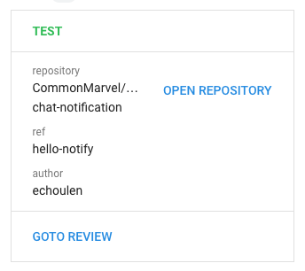
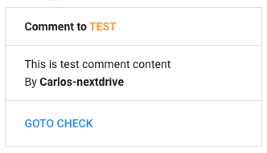
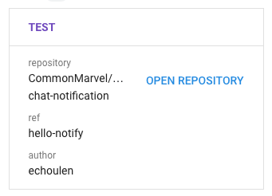

<a href="https://github.com/CommonMarvel/google-chat-notification/actions"></a>





### Usage

Add `notify.yml` to `.github/workflows/`

> .github/workflows/notify.yml
```yaml
name: notify
on:
  pull_request:
    types: [opened, reopened, closed]
  pull_request_review_comment:
    types: [created]
jobs:
  notify:
    runs-on: ubuntu-latest
    steps:
    - name: Google Chat Notification
      uses: CommonMarvel/google-chat-notification@v1.1.1
      with:
        url: ${{ secrets.GOOGLE_CHAT_WEBHOOK }}
```
